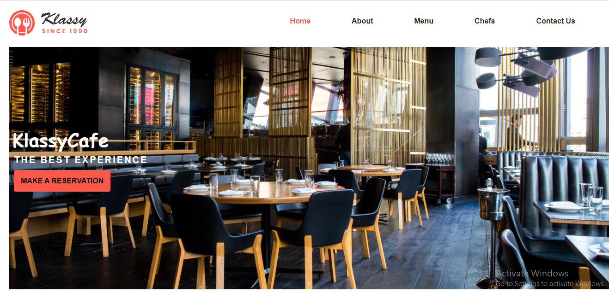
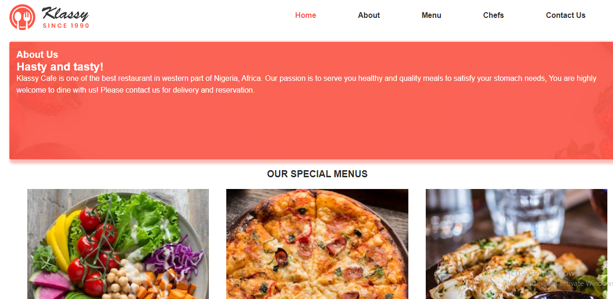
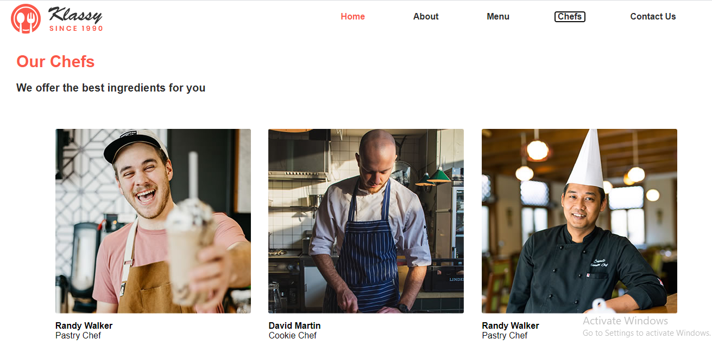
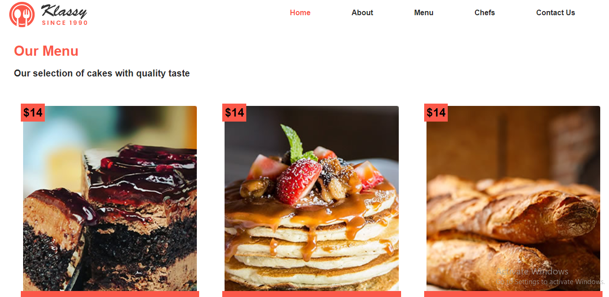
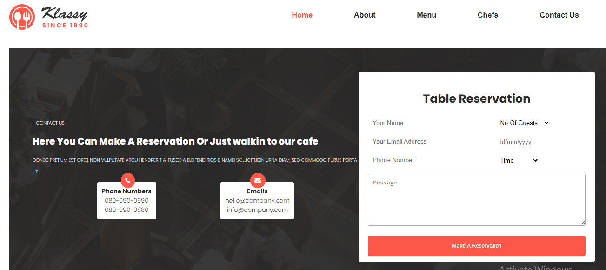

# Odin-restuarant-JS

> This project is an Odin assignment on DOM manipulation and JS Webpack that demonstrates the knowledge of HTML, CSS, Webpack, template literals, DOM manipulation, Let and const, functions, and Importing and Exporting JS files, webpack.

Prettier for code formatting

Styelint for CSS linting

ESlint for JS linting

Github Actions for workflow

Netlify for deployment







Additional description about the project and its features.

## Built With

- Html
- CSS
- Webpack
- JavaScript
- Mark-down

## Live Demo

[Live Demo Link](https://livedemo.com)

### Development (Running locally)

- Clone the project

```bash
git clone https://github.com/bimbolabuari/odin-restuarant-js.git
```

- Install Dependencies

```bash
npm install
```

To run StyleLint by itself, you may run the lint task:

```bash
npm run lint:check
```

Or to automatically fix issues found (where possible):

```bash
npm run lint
```

You can also check against Prettier:

```bash
npm run format:check
```

and to have it actually fix (to the best of its ability) any format issues, run:

```bash
npm run format
```

You can also check against HTML Validator:

```bash
npm run html-validator
```

## Style Guides

- [CSS Style Guide](http://udacity.github.io/frontend-nanodegree-styleguide/css.html)
- [HTML Style Guide](http://udacity.github.io/frontend-nanodegree-styleguide/index.html)
- [JavaScript Style Guide](http://udacity.github.io/frontend-nanodegree-styleguide/javascript.html)
- [Git Style Guide](https://udacity.github.io/git-styleguide/)

## 👤 Author

- Github: [@author](https://github.com/bimbolabuari)
- Twitter: [@author](https://twitter.com/bimbolabuari)
- Linkedin: [@author](https://www.linkedin.com/in/bimbolabuari/)

## 🤝 Contributing

Contributions, issues and feature requests are welcome!

Feel free to check the [issues page](https://github.com/bimbolabuari/odin-restuarant-js/issues).

## Show your support

Give a ⭐️ if you like this project!

## Acknowledgments

- [Template](https://templatemo.com/tm-558-klassy-cafe)
- [Bolah](https://github.com/bolah2009)

## 📝 License

[MIT licensed](./LICENSE).
